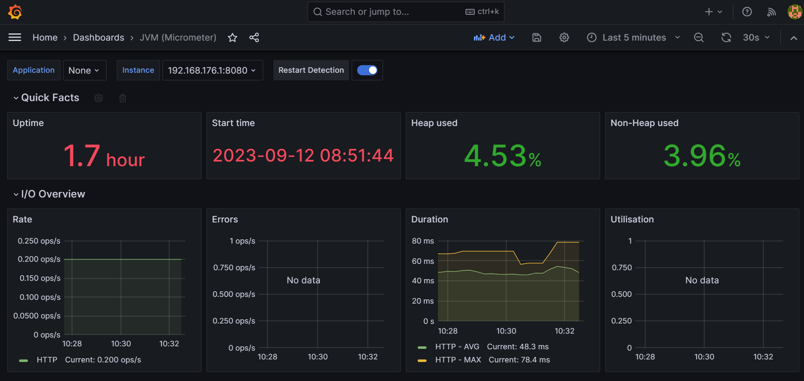

# sample spring boot demo app with prometheus and grafana

## in this one we use java 8

### Steps
 1. install java and docker
 2. create a spring boot app with the following dependencies
      ```
        <dependency>
            <groupId>org.springframework.boot</groupId>
            <artifactId>spring-boot-starter-actuator</artifactId>
        </dependency>
    
        <dependency>
            <groupId>io.micrometer</groupId>
            <artifactId>micrometer-registry-prometheus</artifactId>
        </dependency>
    
        <dependency>
            <groupId>org.springframework.boot</groupId>
            <artifactId>spring-boot-starter-web</artifactId>
        </dependency>
      ```
 3. add this code below in application.yml file
      ```
       management:
        endpoint:
          metrics:
            enabled: true
          prometheus:
            enabled: true
        endpoints:
          web:
            exposure:
              include: prometheus
      ```
 4. run your spring boot app and navigate this url: http://localhost:8080/actuator/prometheus to see some information

 5. now that the app is exposing the metrics data, you can set prometheus to consume it
    create a file name prometheus.yml and put the content below:
    ```
     global:
       scrape_interval:     15s # Default scrape interval

    scrape_configs:
      - job_name: 'prometheus' # Job to scrape Prometheus metrics
        scrape_interval: 5s
        static_configs:
          - targets: ['localhost:9090']

        - job_name: 'spring-actuator'
          metrics_path: '/actuator/prometheus' # Job to scrape application metrics
          scrape_interval: 5s
          static_configs:
            - targets: ['SYSTEM_IP:8080']
      ```
    
 6. run this command
       ```
        docker run -d -p 9090:9090 -v \<absolute_path_to_your_prometheus_file>:/etc/prometheus/prometheus.yml prom/prometheus
       
       ```
    
7. navigate to http://localhost:9090/ and Navigate to targets under Status in the UI header bar.
   Under targets, we should be able to see the two endpoints we defined in the prometheus.yml file with status UP.

8. run this command
    ```
    docker run -d -p 3000:3000 grafana/grafana
   ```
   and navigate to http://localhost:3000 and use admin as login and password to logged in

9. add datasource, select prometheus, give http://localhost:9090 as URL and click save and test

10. click import dashboard and give the id the dashboard (currently 4701 is the id for jvm micrometer), select prometheus and click import

11. finally you may something similar to this image
    